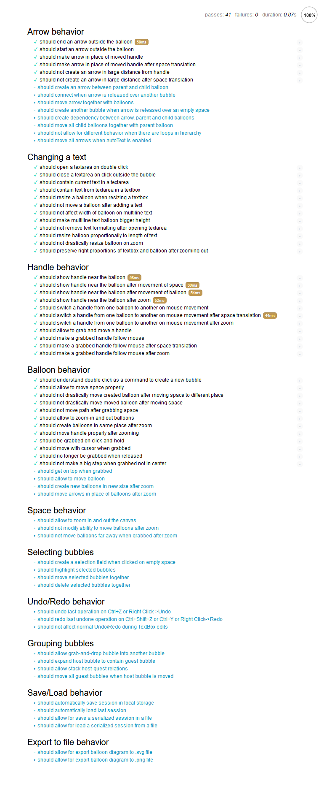

# Floating Balloons
Webpage for floating diagram design system. Written completely in JS on client side, saved locally.

## User stories

User can...

- [x] create a new bubble
- [x] move a bubble
- [x] write text into a bubble
- [ ] set text into a new bubble
- [ ] select many bubbles
- [ ] remove a bubble
- [ ] remove many bubbles
- [ ] connect two bubbles
- [ ] set a hierarchy between bubbles

## Unit tests

I use Mocha to create behavior driven tests.

